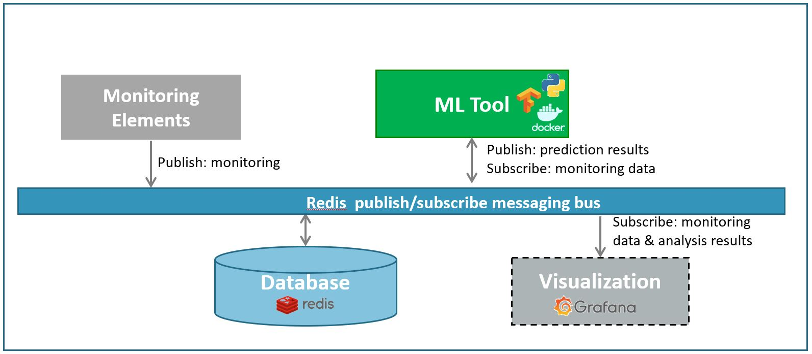

# Robust Online Resource Usage Forecasting

This repository contains code of resource usage forecasting.
This is an ML tool for intent-based networking in the EU project [5G-ERA](https://5g-era.eu/).
By predicting the required resource of a network service or a VNF 
(vitualized network function) and the confidence interval of the prediction,
the operators can allocate network resource proactively to maintain good QoS 
(quality of service).

The streaming time series forecasting method is based on the paper [Stochastic Online Anomaly Analysis for Streaming Time Series](https://www.ijcai.org/proceedings/2017/0445.pdf) (Xu, Kersting, & von Ritter, IJCAI 2017).
The method embeds itself in a Bayesian modeling framework, in particular, 
student-t process, to address time series forecasting problem with resistance to outliers. 
It is full Bayesian, i.e., the hyperparameters of the model can be estimated by the method itself from the data. 
This largely reduces the efforts of end users when they employ the method.
Considering the requirements on computing efficiency in the context of streaming data, 
the method utilizes a stochastic gradient descent based method for online parameter update. 
Accordingly, the inference procedure is improved with an incremental computing manner.


## Dependencies
The code is tested with Python 3.9. The following modules are used: 
- numpy == 1.22.4
- scipy == 1.8.1
- redis == 4.3.3

## Example data
A synthetic dataset is provided to test the ML tool. The example data include noise and outliers.

## Run the test
A pipeline is designed as the figure below. 
Assume a monitoring system continuously publishes monitoring data 
(i.e., data stream) with redis. 
The time series forecasting method (i.e. the ML tool in the figure)
subscribes the corresponding channel via a redis node and 
makes online prediction for the next time slice. 
The prediction results are then published by the ML tool on redis for downstream tasks.
<p align="center">

</p>

To run the test, a redis server should be installed firstly. 
Please refer to the [installation guideline](https://redis.io/docs/getting-started/) for the detailed steps. 
Then run the following commands to test the ML tool for online resource usage forecasting:
```console
$ python redis_publisher.py
$ python redis_online_prediction.py
```


